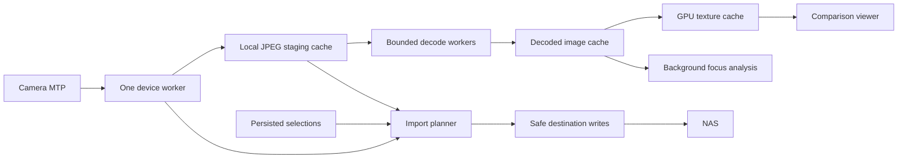

# Fast camera culling: design and implementation scope

This records the September 2026 design discussion. The implementation checklist
is [../TODO.md](../TODO.md); current behavior and measured limits are documented
in [../README.md](../README.md) and [performance.md](performance.md).
Advanced suggestions below remain future possibilities unless checked in TODO.

## Primary workflow

The primary source is a Fujifilm X-T5 shooting RAW+JPEG, usually 200–500 shots
per session. The target PC has a 1440p monitor, 64 GB RAM, and a Ryzen 9950X3D;
GPU and local disk performance are not yet known.

1. Choose the camera folder and destination preset. Begin staging JPEG originals
   on a local SSD immediately after choosing the source.
2. Review JPEGs as they become available. Mark Keep, Reject, or Unreviewed;
   decisions are reversible, with undo/redo and optional automatic advance.
3. Compare any two shots with linked zoom/pan in side-by-side, vertical wipe,
   and momentary A/B blink modes. Pin A while browsing candidates in B.
4. Review the import summary and copy selected assets to their destinations.
   JPEGs go to the picture root; their selected RAF companions go to the RAW
   root; videos go to the video root. Preserve the existing album/date layout.

JPEG+RAW linking defaults to on. A decision on a JPEG selects or deselects its
corresponding RAF. JPEG/RAW/Video filters change visibility, not selection.
Videos default to included without requiring a culling decision, with a clear
include-videos control in the import summary. Missing companions remain visible.

When linking is off, asset selection becomes independent. Switching the setting
must not silently destroy independent choices: retain per-asset selections and
preview any reconciliation needed when linking is enabled again. The final
import plan contains explicit asset IDs, rather than assuming every file sharing
a shot ID is selected. Do not infer pairs from stems across unrelated camera
folders or memory cards; filename counters can repeat.

Unreviewed photos are excluded from import by default and clearly counted in
the review summary. Allow bulk Keep and bulk changes with undo. Camera files
stay intact throughout this workflow.

## What to retain and replace

Retain Rust, egui/eframe, the working CLI behavior, and the dedicated MTP worker
boundary. Keep the existing `safe_copy` no-clobber, same-directory temporary
write and transfer-size checks. NAS publishing must continue through that
boundary, including duplicate-content comparison and retry after failure.

Replace the monolithic viewer and preview scheduling with separate session,
staging, image-cache, comparison-viewer, commands, and import components. This
does not require changing GUI toolkit or rewriting functioning device code.

The inspected implementation has concrete limitations:

- `decode_jpeg_preview` decodes the entire JPEG before resizing. Analysis and
  thumbnail requests can decode the same source again.
- Preview requests spawn a new thread each time; there is no bounded priority
  scheduler to favor the active view over obsolete requests.
- Thumbnails and full previews share an 18-entry texture cache. Entry counts
  do not control memory consumption when resolutions differ enormously.
- MTP prefetch only covers the current shot and two neighbors in either
  direction. Queued requests have no reprioritization after a navigation jump.
- Import reads selected JPEGs from the camera again despite having cached them.
- A/B only compares the selected shot with the next shot. Its panes have
  separate zoom and scroll state, and there is no wipe mode.
- First-time local session loading waits for hashing and JPEG analysis across
  all assets before publishing a session. Direct MTP decisions are in-memory.

## Pipeline and scheduling

Keep camera I/O serialized through its owning worker. Parallelize decoding and
analysis after bytes reach the local disk. Use a bounded worker pool and queues;
start conservatively with 4–8 CPU workers and tune using actual JPEG benchmarks.
Reject obsolete work using session generations and demand versions.

Priority is active A/B, nearby candidates in the navigation direction, visible
filmstrip thumbnails, then remaining JPEGs. An active request can jump ahead
of queued background work; ongoing camera operations yield only at supported
safe boundaries. Full-session JPEG staging proceeds whenever demand is caught
up, subject to a disk quota. RAW and video transfers normally wait for import.

Keep these caches separate and bounded in bytes:

- Compressed originals on disk, reusable for import without JPEG recompression.
- Small thumbnails, generated once rather than repeatedly from the original.
- Display-sized decoded previews, sized for the actual viewport and display DPI.
- Full-resolution decoded JPEGs around the active candidates and pinned A.
- GPU textures, with visible A/B pinned against eviction and a bounded upload
  budget per frame. CPU cache capacity must not imply equal GPU capacity.

An initial CPU cache budget of 8 GiB is reasonable for this 64 GB machine;
use a separate conservative GPU budget, initially around 512 MiB and adjustable
after inspecting the GPU. A 40-megapixel RGBA image is approximately 160 MB,
before decoder buffers, analysis data, or GPU copies. Never retain every shot
at full resolution. Prefetch full-resolution neighbors when inspecting focus,
so changing B does not require a fresh decode on every keypress.

Benchmark the current `image`/zune-jpeg path against libjpeg-turbo with scaled
decoding for fit views and direct output into the desired pixel layout. Choose
based on total decode/orientation/resize/conversion time and pixel correctness
on real X-T5 JPEGs. A newer dependency version alone is not a performance result.
Use embedded/device thumbnails where useful for early filmstrip display; a
thumbnail is never sufficient evidence for judging native-resolution focus.

Enumerate metadata incrementally and make the first available shots usable
before full-session hashing or sharpness analysis completes. Hash staged data
during transfer where practical. Persist decisions asynchronously with ordered
writes and flush on session close; keyboard feedback stays in memory immediately.

## Comparison canvas

Use a custom egui canvas with one shared image-space viewport: scale, center,
and orientation-correct coordinates. Both panes consume that viewport instead
of maintaining independent scroll areas. Zoom is anchored at the cursor and
pan follows drag input. At 100%, one source pixel maps to one physical display
pixel, accounting for egui's logical-point scale.

In wipe mode, draw both images with the same transform and clip them to opposite
sides of a draggable vertical divider. Keyboard actions move/reset the divider.
Dragging it changes clipping; it does not decode, resize, or composite a new
bitmap. Side-by-side mode maps the same image-space center into each pane.

Hold-to-blink switches A/B at the same scale and crop. Native-resolution content
must be identified as ready; do not silently judge a magnified fit preview as
full resolution. Changing views preserves the comparison center and scale.

Small camera movement can make shared coordinates land on different subject
features. Add optional manual B alignment first, with an explicit reset and
indicator. Automatic registration can be a later addition. Avoid resampling an
aligned image before computing native-resolution focus evidence.

## Focus assistance

Add a toggleable focus-peaking overlay and a shared rectangular region of
interest. Compute luminance gradient or multi-scale high-frequency energy on
native-resolution data in the background. Suppress isolated noise, and apply
consistent analysis settings and overlay thresholds to A and B. Threshold and
opacity controls should update presentation without redecoding the image.

Compare the same subject crop at the same source-pixel scale. A score over the
whole image mixes subject focus with background texture, noise, contrast, and
JPEG sharpening. It is a hint, not an automatic Keep decision or a reason to
globally rank unrelated photographs. The current 1024-pixel analysis loses
fine detail and should not be the primary focus judgement for these JPEGs.

Start with peaking and region scores; validate against pairs with known focus
differences, different ISO values, and different scene texture. Eye/face region
suggestions and automatic burst winner suggestions can follow once useful.

## Keyboard and session behavior

Route buttons and shortcuts through one command registry, including configurable
bindings, conflict detection, help, and a searchable command palette. Text
fields and modal dialogs must consume input before culling actions.

Suggested defaults: arrows browse, `1` Reject, `2` Keep, `0` clear, Space toggle
Keep, `Z` fit/100%, `P` pin A, `C` cycle comparison modes, hold `B` to blink,
`H` focus overlay, and Ctrl+Z/Ctrl+Shift+Z undo/redo. Provide commands for active
pane selection, selecting A or B, swapping A/B, filters, region controls,
divider position, previous/next burst, import, and cancellation as well.

Persist resumable session manifests and staged-file availability. Remote object
IDs and USB locations are not durable content identities: re-enumerate after
reconnect and validate device/storage, relative path, size, and available
timestamps/identifiers before associating decisions. Ambiguous or changed items
need reconciliation; transferred content hashes establish stronger identities.

Imports reuse verified staged originals and fetch only missing selected assets.
Record progress per asset so NAS or camera disconnects can resume safely. Never
clean a needed staging file until its destination result is confirmed. Provide
cache quota, pause/cancel, intentional session close, and stale-session cleanup.

## Implementation order and acceptance

1. Upgrade dependencies and establish baseline timings on real files. Record
   enumeration, camera throughput, decode, resize, texture upload, frame time,
   navigation latency, cache hits, RAM and GPU memory.
2. Build the local-folder comparison canvas: pin A, linked zoom/pan,
   side-by-side, wipe, blink, selection commands, undo/redo. Keep it independent
   of camera hardware for repeatable performance checks.
3. Add bounded decode scheduling, separate caches, directional prefetch, and
   background JPEG staging. Wire the same session model to MTP.
4. Add persisted sessions, JPEG+RAW linking settings, media filters,
   default-included videos, cache-reusing imports, progress and cancellation.
5. Add and validate focus assistance and then optional burst grouping/alignment.

Warm-cache navigation target: p95 input-to-submitted-frame at or below 20–30 ms
on the target PC, with interactive pan/wipe within the display's frame budget.
Measure presentation separately where possible. Report cold camera transfers
separately; they cannot meet the same bound before the required bytes arrive.

Exercise rapid forward/reverse navigation, pinned A, full-resolution B changes,
and long sessions under memory limits. Functional checks must cover linking on
and off, filter-independent selections, videos, repeated stems in different
folders, stale results, disconnects, failed imports, and retry without overwrite.
Use release builds for performance measurements. These are proposed acceptance
targets, not measured guarantees.

## Dependency refresh completed September 30, 2026

Direct dependencies were checked against crates.io stable releases. Updated
egui/eframe and egui_extras to 0.36.2, mtp-rs to 0.32.0, and the available
patch releases for BLAKE3, clap, rusqlite, log, trash, futures, tempfile, and url.
Refreshed the transitive lockfile. `image` 0.25.10 was already current.

The Linux adapter uses `collect_objects` and reports incomplete listings instead
of silently accepting the new library's recoverable per-object omissions. This
preserves the previous complete-enumeration behavior during the dependency upgrade.

Validation: Windows's 17 existing tests, formatting, strict Clippy, and CLI help.
The Linux worker was also compiled against mtp-rs 0.32.0 on Windows in an ignored
temporary harness, with its existing tests and enumeration regression tests.
This does not validate native Linux USB behavior or physical camera operation.

Sources for decoder evaluation and camera dimensions:
[image release notes](https://github.com/image-rs/image/blob/main/CHANGES.md),
[libjpeg-turbo](https://github.com/libjpeg-turbo/libjpeg-turbo), and
[X-T5 specifications](https://www.fujifilm-x.com/en-gb/products/cameras/x-t5/specifications/).
